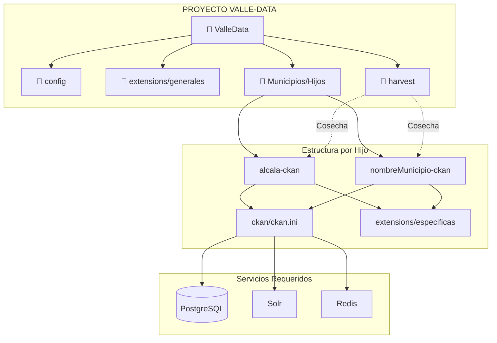

# README #

## 🏗️ Arquitectura del Repositorio



---

# Arquitectura del Proyecto Valle-Data

```bash
ValleData/
├── ⚙️ config/               # Despliegue uWsgi (alcala-ckan-uwsgi.ini)
├── 🧩 extensions/           # Plugins Globales (Auth, LDAP, Spatial)
├── 🌾 harvest/              # Módulo de Recolección Central
│   └── 🧩 extensions/       # Plugins específicos (DCAT, Harvest)
│
├── 🏙️ alcala-ckan/          # PLANTILLA PARA HIJOS (Municipios)
│   ├── 🛠️ ckan/
│   │   └── 📄 ckan.ini      # CONFIGURACIÓN ÚNICA (DB, Solr, URL)
│   └── 🧩 extensions/       # Plugins Locales (ckanplugin)
│
└── 📄 requirements.txt      # Dependencias generales
```
--- 

## 📊 Diagrama de Relaciones de CKAN (Tablas Core)
erDiagram
    USER ||--o{ MEMBER : "tiene roles en"
    GROUP ||--o{ MEMBER : "pertenece a"
    GROUP ||--o{ PACKAGE : "es dueño de (Organización)"
    PACKAGE ||--o{ RESOURCE : "contiene"
    PACKAGE ||--o{ PACKAGE_EXTRA : "extiende metadatos"
    PACKAGE ||--o{ PACKAGE_TAG : "clasificado en"
    TAG ||--o{ PACKAGE_TAG : "asociado a"
    USER ||--o{ ACTIVITY : "realiza"

    USER {
        varchar id PK
        varchar name UK
        varchar fullname
        varchar email
        varchar password
        boolean sysadmin
        timestamp created
        varchar apikey
    }

    GROUP {
        varchar id PK
        varchar name UK
        varchar title
        text description
        varchar type "group / organization"
        varchar state "active / deleted"
        timestamp created
    }

    MEMBER {
        varchar id PK
        varchar group_id FK
        varchar user_id FK
        varchar table_name "indica si es user o group"
        varchar capacity "admin / editor / member"
        varchar state "active / deleted"
    }

    PACKAGE {
        varchar id PK
        varchar name UK "URL slug"
        varchar title
        text notes "Descripción del Dataset"
        varchar license_id
        varchar owner_org FK "Group ID de la Org"
        varchar state "active / deleted"
        timestamp metadata_created
        timestamp metadata_modified
    }

    RESOURCE {
        varchar id PK
        varchar package_id FK
        varchar url "Ruta al archivo o API"
        varchar format "csv, pdf, json, etc"
        varchar name
        text description
        bigint size
        varchar state "active / deleted"
        timestamp created
        timestamp last_modified
    }

    PACKAGE_EXTRA {
        varchar id PK
        varchar package_id FK
        text key "Nombre del campo"
        text value "Valor del campo"
    }

    TAG {
        varchar id PK
        varchar name UK
        varchar vocabulary_id FK
    }

    PACKAGE_TAG {
        varchar package_id PK, FK
        varchar tag_id PK, FK
        varchar state "active / deleted"
    }

    ACTIVITY {
        varchar id PK
        timestamp timestamp
        varchar user_id FK
        varchar object_id "ID del elemento afectado"
        varchar activity_type "new_package, changed_resource, etc"
        text data "JSON resumido del cambio"
    }
--- 

--- 
## Cómo agregar un nuevo Municipio (Hijo)

1. **Clonar:** Duplica la carpeta `alcala-ckan` y cámbiale el nombre a `[nombreMunicipio]-ckan`.
2. **Configurar:** Edita el archivo `ckan/ckan.ini` dentro de la nueva carpeta:
   - Cambia `site_url` y el puerto.
   - Configura las cadenas de conexión para: `Solr`, `Datapusher`, `Redis` y `PostgreSQL`.
3. **Harvest:** Crea un nuevo Job en el módulo Harvest apuntando al `data.json` del nuevo hijo.

---
## Variables de Entorno usadas para modificar el ckan.ini del proyecto, tener en cuenta de que cada hijo y harvest tiene su propio archivo de configuracion

	#Postgres
	- POSTGRES_USER
	- POSTGRES_PASSWORD
	- POSTGRES_DB
	- CKAN_DB_USER
	- CKAN_DB_PASSWORD
	- CKAN_DB
	- DATASTORE_READONLY_USER
	- DATASTORE_READONLY_PASSWORD
	- DATASTORE_DB
	
	#Ckan
	- CKAN_SITE_ID
	- CKAN_SECRET_KEY
	- CKAN_SITE_URL
	- CKAN_SQLALCHEMY_URL	
	- CKAN_BEAKER__SESSION__SECRET
	- CKAN_API_TOKEN__JWT__ENCODE__SECRET
	- CKAN_API_TOKEN__JWT__DECODE__SECRET
	- CKAN_SOLR_URL
	- CKAN_REDIS_URL
	- CKAN_DATAPUSHER_URL
	- CKAN__DATAPUSHER__CALLBACK_URL_BASE
	- CKAN__PLUGINS
	
	# Variables de ckan.ini para el proceso del Datapusher
	- CKAN_DATASTORE_WRITE_URL
	- CKAN_DATASTORE_READ_URL
	- DATAPUSHER_API_TOKEN
	
---	

# VALLE DATA

Sistema federado de datos abiertos basado en CKAN, implementando una arquitectura **Padre - Hijos** para la gestión, publicación y federación de información institucional del departamento.

---

## Arquitectura del Sistema

El sistema se basa en la tecnología CKAN implementando un modelo federado que optimiza la gobernanza de datos regionales:

### CKAN Padre (Nodo Central)

Actúa como el núcleo de federación encargado del proceso de **Harvesting** (cosecha de metadatos).

Funciones principales:

* Consolidar el catálogo departamental.
* Federar metadatos provenientes de múltiples entidades.
* Centralizar la consulta de datasets.
* Evitar la duplicación física de recursos.
* Administrar los procesos de federación y sincronización.

### CKAN Hijos (Instancias Independientes)

Catorce (14) nodos institucionales responsables de:

* Administración de sus datasets.
* Publicación de información.
* Actualización de recursos.
* Gestión autónoma de metadatos.

Este enfoque garantiza la autonomía técnica y operativa de cada entidad participante.

---

# Instalación

La documentación completa de instalación y despliegue se encuentra disponible en:

[Documentación Técnica VALLE DATA](https://docs.google.com/document/d/1xZQ8j7tAkxGgShaVeA_ruW5f_h3JPvb4/edit?usp=drive_link&ouid=104869156579894684414&rtpof=true&sd=true&utm_source=chatgpt.com)

---

# Arquitectura de Persistencia

## Volúmenes Persistentes

### CKAN

```yaml
ckan_storage:/var/lib/ckan
pip_cache:/root/.cache/pip
site_packages:/usr/lib/python3.10/site-packages
```

### PostgreSQL

```yaml
pg_data:/var/lib/postgresql/data
```

### Solr

```yaml
solr_data:/var/solr
```

### Redis

Servicio de caché y cola de procesos.

---

# Archivos de Configuración para despliegue

## Principales

```bash
CKAN.ini
uwsgi.py
ckan-uwsgi.ini 
```

---

# Servicios Orquestados

| Servicio   | Puerto | Descripción                               |
| ---------- | ------ | ----------------------------------------- |
| Datapusher | 8800   | Procesamiento y carga automática de datos |
| Solr       | 8983   | Motor de indexación y búsqueda            |
| Redis      | 6379   | Cache y cola de tareas                    |
| CKAN       | 5000   | Portal principal                          |
| Harvest    | 5100   | Servicio de federación                    |

---

# Despliegue

Los servicios de:

* Datapusher
* CKAN
* Harvester

se despliegan mediante:

```bash
uWSGI
```

---

# Solr Core

> **Importante**
>
> Para cada instancia CKAN se debe crear un **Core** en el servicio de Apache Solr.
>
> Este espacio es utilizado por Solr para almacenar la base de datos local correspondiente a los datasets y recursos cargados en cada portal.

---

# Servicios Utilizados por Harvest

## Procesos de Federación

### fetch-consumer

Servicio encargado de descargar y procesar metadatos desde las fuentes federadas.

### gather-consumer

Servicio encargado de recopilar datasets y preparar los procesos de sincronización.

### Worker

Servicio utilizado para balanceo y procesamiento de cargas asincrónicas.

---

# Extensiones Utilizadas

## CKAN
* ckanext-ckanplugin
* ckanext-geoview
* ckanext-spatial

## Harvester
* ckanext-harvest
* ckanext-harvestplugin

## Extensiones Globales
* ckanext-auth
* ckanext-envvars
* ckanext-ldap
* ckanext-metrics_dashboard
* ckanext-report
* ckanext-dcat
* ckanext-scheming

---

# Tecnologías Utilizadas

* CKAN
* PostgreSQL
* Apache Solr
* Redis
* uWSGI
* Docker
* Linux Ubuntu

---

# Objetivo del Proyecto

VALLE DATA busca consolidar un ecosistema interoperable de datos abiertos que permita:

* Centralizar la consulta de información pública.
* Facilitar procesos de interoperabilidad institucional.
* Garantizar autonomía tecnológica de cada entidad.
* Implementar procesos de federación escalables.
* Mejorar el acceso y reutilización de datos abiertos.

---

# Notas Técnicas

* Cada instancia CKAN debe contar con:

  * Base de datos PostgreSQL independiente.
  * Core Solr independiente.
  * Configuración propia de Harvest.
  * Volúmenes persistentes dedicados.

* El nodo Padre únicamente federa metadatos y no duplica físicamente los archivos publicados por los nodos Hijos.

* Los procesos Harvest se ejecutan de forma asincrónica mediante workers y consumidores especializados.

___

# Ruta del Proyecto

```bash
cd  /usr/lib/ckan/default/src/
```
___

# Nos ubicamos en donde vamos a decargar el proyecto

```bash
	git clone https://github.com/jumargo73/ValleData.git
```
___

# Copiamos los archivos de Configuracion

```bash
cp -r /usr/lib/ckan/default/src/ValleData/alcala-ckan/config/ckan.iniexample /usr/lib/ckan/default/src/ValleData/alcala-ckan/config/ckan.ini
cp -r /usr/lib/ckan/default/src/ValleData/alcala-ckan/deployment/ckan-uwsgi.iniexample /usr/lib/ckan/default/src/ValleData/alcala-ckan/deployment/ckan-uwsgi.ini
cp -r /usr/lib/ckan/default/src/ValleData/harvest/config/ckan.iniexample /usr/lib/ckan/default/src/ValleData/harvest/config/ckan.ini
cp -r /usr/lib/ckan/default/src/ValleData/harvest/deployment/ckan-uwsgi.iniexample /usr/lib/ckan/default/src/ValleData/harvest/deployment/ckan-uwsgi.ini
cp -r /usr/lib/ckan/default/src/ValleData/docker_datapusher/datapusher_images/deployment/datapusher-uwsgi.iniexample /usr/lib/ckan/default/src/ValleData/docker_datapusher/datapusher_images/deployment/datapusher-uwsgi.ini

```
___

# Despliegue por Resource

## Creacion Entornos virtuales
```bash
	mkdir -p /usr/lib/ckan/default/ckan
	python3 -m venv /usr/lib/ckan/default/ckan

	mkdir -p /usr/lib/ckan/default/harvest
	python3 -m venv /usr/lib/ckan/default/harvest

	mkdir -p /usr/lib/ckan/default/datapusher
	python3 -m venv /usr/lib/ckan/default/datapusher


	se crean la carpeta de produccion
	mkdir -p /usr/lib/ckan/default/src
```
___

## Se aplica permisos
```bash
sudo chmod -R 777  /usr/lib/ckan/default/
```
___

## Ingresamos al proyecto

```bash
	cd /usr/lib/ckan/default/src/ValleData
```
___

## Instalacion Ckan(alcala_ckan)  2.11.5
```bash
	. /usr/lib/ckan/default/ckan/bin/activate
	
	sudo chmod +x instalar_ckan.sh

	pip install --upgrade pip uwsgi wheel rq>=1.14.0,<2.0.0 "setuptools>=44.1.0,<82" Werkzeug==2.3.7 Flask==2.3.3 

	cd /usr/lib/ckan/default/src/ValleData/alcala-ckan/ckan
	pip install -r requirements.txt
	pip install -e .

	sudo cp -r /usr/lib/ckan/default/src/ValleData/alcala-ckan/config/ckan.ini /usr/lib/ckan/default/src/ValleData/alcala-ckan/ckan

	Inicializar la BD
	cd alcala-ckan/ckan
	ckan db init
	ckan db upgrade -p CkanPlugin
```

## Instalacion Ckan(harvest) 2.11.5

```bash

. /usr/lib/ckan/default/harvest/bin/activate

sudo chmod +x instalar_harvest.sh
sed -i 's/\r$//' instalar_harvest.sh
bash instalar_harvest.sh

pip install --upgrade pip uwsgi wheel rq>=1.14.0,<2.0.0 "setuptools>=44.1.0,<82" Werkzeug==2.3.7 Flask==2.3.3 

cd /usr/lib/ckan/default/src/ValleData/harvest/ckan
pip install -r requirements.txt
pip install -e .

sudo cp -r /usr/lib/ckan/default/src/ValleData/harvest/config/ckan.ini /usr/lib/ckan/default/src/ValleData/harvest/ckan

Inicializar la BD
cd harvest/ckan
ckan db init
ckan  db upgrade -p harvest
ckan  db upgrade -p report
```

## Reconstruir los asset para Ckan(ejemplo alcala) si y solo si sale error de permisos en webassets al despliegue

## Si tu ruta de de trabajo (Entorno Virtual) es  /usr/lib/ckan/default/ 

## El directorio de trabajo es /usr/lib/ckan/default/src/

```bash
rm -rf /usr/lib/ckan/default/src/ValleData/alcala-ckan/ckan/public/webassets/*
/usr/lib/ckan/default/bin/ckan -c /usr/lib/ckan/default/src/ValleData/alcala-ckan/ckan/ckan.ini asset build
chmod -R 775 /var/lib/ckan/
```

# Generacion de Reportes para Harvest

```bash
/usr/lib/ckan/default/bin/ckan -c /usr/lib/ckan/default/src/ValleData/harvest/ckan/ckan.ini report generate reporte-federacion
http://<url>/report/reporte-federacion
/usr/lib/ckan/default/bin/ckan -c /usr/lib/ckan/default/src/ValleData/harvest/ckan/ckan.ini report metrics-dashboard
http://<url>/report/metrics-dashboard
```

# Despliegue por Docker

## Nos ubicamos en la Raiz de nuestro proyecto

```bash
cd  /usr/lib/ckan/default/src/ValleData/
```

## Crear Imagen para Ckan_Hijos

```bash
docker build -t CKAN/ckan:2.11.4 \
-f ckan_dockerfile \
.
```

```bash
docker build -t Harvest/ckan:2.11.4 \
-f harvest_dockerfile \
.
```

## Comandos para crear tus redes

```bash
# Redes para el CKAN Federado
docker network create net-db
docker network create net-fed-internal

# Redes para el CKAN Hijo
docker network create net-hijo-internal

# Red común para Nginx
docker network create net-nginx

```

## Subir el contenedor de la BD

```bash
docker compose -f docker_postgres/docker-compose.yml build
docker compose -f docker_postgres/docker-compose.yml up -d

```

## Validar si se crearon las BD de Alcala y Harvest

```bash
docker exec -u root -it docker_postgres-db-1 bash
psql -U postgres
\l
                                                              List of databases
           Name           |    Owner     | Encoding |  Collate   |   Ctype    | ICU Locale | Locale Provider |       Access privileges
--------------------------+--------------+----------+------------+------------+------------+-----------------+-------------------------------
 alcala_ckan_default      | ckan_default | UTF8     | en_US.utf8 | en_US.utf8 |            | libc            | =Tc/ckan_default             +
                          |              |          |            |            |            |                 | ckan_default=CTc/ckan_default
 alcala_datastore_default | ckan_default | UTF8     | en_US.utf8 | en_US.utf8 |            | libc            | =Tc/ckan_default             +
                          |              |          |            |            |            |                 | ckan_default=CTc/ckan_default
 ckan_default             | ckan_default | UTF8     | en_US.utf8 | en_US.utf8 |            | libc            | =Tc/ckan_default             +
                          |              |          |            |            |            |                 | ckan_default=CTc/ckan_default

```


# Subir el proyecto alcala
```bash
docker compose -f alcala-ckan/docker-compose.yml build
docker compose -f alcala-ckan/docker-compose.yml up -d
```

# Subir el contenerod ngix

```bash
#si y solo si la aplicacion este arriba
docker compose -f nginx/docker-compose.yml build
docker compose -f nginx/docker-compose.yml up -d

```

# ASi debe quedar el despliegue de ckan-alcala

```bash
CONTAINER ID   IMAGE                              COMMAND                  CREATED         STATUS                   PORTS                                         NAMES
0fb636cdc780   CKAN/ckan:2.11.4                   "/srv/app/bin/uwsgi …"   4 minutes ago   Up 3 minutes (healthy)   0.0.0.0:5000->5000/tcp, [::]:5000->5000/tcp   alcala-ckan-ckan-1
c7944f95a9e6   ckan/ckan-base-datapusher:0.0.21   "/srv/app/datapusher…"   4 minutes ago   Up 4 minutes (healthy)   8800/tcp                                      alcala-ckan-datapusher-1
1d8b5ae17482   CKAN/ckan-solr:2.10-solr9          "docker-entrypoint.s…"   4 minutes ago   Up 4 minutes (healthy)   8983/tcp                                      alcala-ckan-solr-1
405da041b6e7   CKAN/redis:7                       "docker-entrypoint.s…"   4 minutes ago   Up 4 minutes (healthy)   6379/tcp                                      alcala-ckan-redis-1
b934b8307c8d   CKAN/postgres:15                   "docker-entrypoint.s…"   2 hours ago     Up 2 hours (healthy)     5432/tcp                                      docker_postgres-db-1
```


# Configuración de Solr

## Crear Core CKAN

```bash
docker exec -u solr -it alcala-ckan-solr-1 \
solr create_core -c ckan
```

# Inicializar las BD de Ckan

```bash

docker exec -u ckan -it alcala-ckan-ckan-1 \
ckan db init

docker exec -u ckan -it alcala-ckan-ckan-1 \
ckan db upgrade

## si y solo si con upgrade no la vez reflejado
docker exec -u ckan -it alcala-ckan-ckan-1 \
ckan db upgrade -p CkanPlugin

```
# validar las migraciones
```bash
docker exec -u root -it docker_postgres-db-1  psql -U postgres
\c alcala_ckan_default
\lt

alcala_ckan_default=# \dt
                       List of relations
 Schema |             Name              | Type  |    Owner
--------+-------------------------------+-------+--------------
 public | CkanPlugin_alembic_version    | table | ckan_default
 public | activity                      | table | ckan_default
 public | activity_alembic_version      | table | ckan_default
 public | activity_detail               | table | ckan_default
 public | alembic_version               | table | ckan_default
 public | api_token                     | table | ckan_default
 public | comments                      | table | ckan_default
 public | contador                      | table | ckan_default
 public | dashboard                     | table | ckan_default
 public | group                         | table | ckan_default
 public | group_extra                   | table | ckan_default
 public | group_extra_revision          | table | ckan_default
 public | group_revision                | table | ckan_default
 public | member                        | table | ckan_default
 public | member_revision               | table | ckan_default
 public | package                       | table | ckan_default
 public | package_extra                 | table | ckan_default
 public | package_extra_revision        | table | ckan_default
 public | package_member                | table | ckan_default
 public | package_relationship          | table | ckan_default
 public | package_relationship_revision | table | ckan_default
 public | package_revision              | table | ckan_default
 public | package_tag                   | table | ckan_default
 public | package_tag_revision          | table | ckan_default
 public | resource                      | table | ckan_default
 public | resource_rating               | table | ckan_default
 public | resource_revision             | table | ckan_default
 public | resource_view                 | table | ckan_default
 public | revision                      | table | ckan_default
 public | system_info                   | table | ckan_default
 public | system_info_revision          | table | ckan_default
 public | tag                           | table | ckan_default
 public | task_status                   | table | ckan_default
 public | term_translation              | table | ckan_default
 public | tracking_raw                  | table | ckan_default
 public | tracking_summary              | table | ckan_default
 public | user                          | table | ckan_default
 public | user_following_dataset        | table | ckan_default
 public | user_following_group          | table | ckan_default
 public | user_following_user           | table | ckan_default
 public | vocabulary                    | table | ckan_default
(41 rows)

\q para salir
```

# Dapapusher Configuraciones

# Aplicando Permisos para BD Datapusher

```bash
docker exec -u ckan -it alcala-ckan-ckan-1 \
ckan datastore set-permissions > ds.sql

docker cp ds.sql docker_postgres-db-1:/ds.sql

docker exec -it docker_postgres-db-1 psql -U ckan_default -d alcala_datastore_default -f /ds.sql
```

#resultado
```bash
REVOKE
GRANT
GRANT
GRANT
GRANT
REVOKE
GRANT
GRANT
GRANT
ALTER DEFAULT PRIVILEGES
CREATE VIEW
ALTER VIEW
GRANT
CREATE FUNCTION
ALTER FUNCTION
DO
```
# Aplicando Permisos para BD Datapusher

# creacion de Usuario y Tocken para API Datapusher

```bash
docker exec -u ckan -it alcala-ckan-ckan-1 \
ckan -c /srv/app/ckan.ini sysadmin add federacion_api

docker exec -u ckan -it alcala-ckan-ckan-1 \
ckan -c /srv/app/ckan.ini user token add federacion_api federacion_api_token

El resultado lo asignas a la variable  DATAPUSHER_API_TOKEN
```

```bash
docker restart alcala-ckan-ckan-1
docker logs -f --tail 50 alcala-ckan-ckan-1
```

# desplegando Harvest

```bash
docker compose -f harvest/docker-compose.yml up -d
```

# Inicializando DB Harvest

```bash
docker compose -f harvest/docker-compose.yml up -d
```

# Configuración de Solr

## Crear Core CKAN

```bash
docker exec -u solr -it harvest-solr-1 \
solr create_core -c ckan
```


# Inicializar las BD de Ckan

```bash

docker exec -u ckan -it harvest-harvest-1 \
ckan db init

docker exec -u ckan -it harvest-harvest-1 \
ckan db upgrade
```

```bash
docker restart harvest-harvest-1
docker logs -f --tail 50 harvest-harvest-1
```

### ASi debe quedar el despliegue de ckan-alcala

```bash
CONTAINER ID   IMAGE                              COMMAND                  CREATED             STATUS                        PORTS                                                                                NAMES
f6cd7e5f8f93   Harvest/ckan:2.11.4                "ckan -c /srv/app/ck…"   3 minutes ago       Up 3 minutes (healthy)        5000/tcp                                                                             harvest-harvest-gather-1
75bd494e33b5   Harvest/ckan:2.11.4                "ckan jobs worker"       3 minutes ago       Up 3 minutes (healthy)        5000/tcp                                                                             harvest-worker-1
7deadd494fd4   Harvest/ckan:2.11.4                "ckan -c /srv/app/ck…"   3 minutes ago       Up 3 minutes (healthy)        5000/tcp                                                                             harvest-harvest-fetch-1
8220c2e71ba4   Harvest/ckan:2.11.4                "/srv/app/bin/uwsgi …"   3 minutes ago       Up About a minute (healthy)   0.0.0.0:5001->5000/tcp, [::]:5001->5000/tcp                                          harvest-harvest-1
189d4c4637b0   CKAN/ckan-solr:2.10-solr9          "docker-entrypoint.s…"   3 minutes ago       Up 3 minutes (healthy)        8983/tcp                                                                             harvest-solr-1

```
--- 
## Despliegue por Kubernate
```bash
kind load docker-image CKAN/ckan-solr:2.10-solr9 --name ckan-cluster
kind load docker-image CKAN/ckan:2.11.4 --name ckan-cluster
kind load docker-image CKAN/harvest:2.11.4 --name ckan-cluster
kind load docker-image CKAN/redis:7  --name ckan-cluster
kind load docker-image ckan/ckan-base-datapusher:0.0.21 --name ckan-cluster
```
---

# 16. Configurar PostgreSQL Externo

Obtener IP:

```bash
docker inspect docker_postgres-db-1 | grep -A 10 "kind"
```

Actualizar:

```yaml
endpoints:
  - addresses:
      - "172.18.0.3"
```

Archivo:

```text
k8s/postgres-external.yaml
```

---
# 17. Despliegue Kubernetes

```bash
kubectl apply -f k8s/postgres-external.yaml
kubectl apply -f k8s/ckan_app.yaml
kubectl apply -f k8s/harvest_app.yaml
```
---

## 18 Creando Nuevos Hijos
# Creando Nuevos Hijos si ya esta alcala funcional 100%

Se duplica la carpeta  docker_ckan que se encuentra en nuestro proyecto y lo renombras por ejemplo si vamos a montar pradera quedaria pradera_ckan

- En el archivo docker_compose.yml en la parte de volumenes cambiar name_ por pradera_ , name- por pradera- y en el puerto ports: - "5001:5000", (si 5001 este libre sino 500x donde xx es el puerto libre)
  en el service ckan, pradera va por el puerto 5001 debido a que alcala esta por el 5000 asi susesivamente para los demas hijos, hay que garantizar que los puertos no se repitan

- En /config/ckan.ini  cambiar  name- por pradera- , name. por pradera. name_ por  pradera_ Y ckan.site_title = NAME(ENTIDAD) Ejemplo pradera

# Inicializar app

```bash
docker compose -f pradera-ckan/docker-compose.yml up -d
```

Crear la BD de ckan_default como pradera_ckan y datastore_default  pradera_datastore_default

## Ingresar a PostgreSQL:

```bash
docker exec -it docker_postgres-db-1 psql -U postgres
```

## Listar Bases de Datos

```sql
\l
```

```bash
docker exec -it docker_postgres-db-1 \
psql -U postgres -c "CREATE DATABASE pradera_ckan_default OWNER ckan_default;"

docker exec -it docker_postgres-db-1 \
psql -U postgres -c "GRANT ALL PRIVILEGES ON DATABASE pradera_ckan_default TO ckan_default;"

docker exec -it docker_postgres-db-1 \
psql -U postgres -c "CREATE DATABASE pradera_datastore_default OWNER ckan_default ENCODING 'UTF8';"

```

Inicializar las BD de Ckan en pradera dento del contenedor pradera-ckan-ckan-1 con los comandos 


El resto de configuraciones que se ejecutaron para levantar el core de alcala se aplican para todos los  hijos es decir ejecutar migraciones, permisos datapusher, creacion usuario y tocker , etc 

```bash
docker exec -u ckan -it pradera-ckan-ckan-1 \
ckan db init

docker exec -u ckan -it pradera-ckan-ckan-1 \
ckan db upgrade

docker exec -u ckan -it pradera-ckan-ckan-1 \
ckan db upgrade -p CkanPlugin

docker exec -u ckan -it pradera-ckan-ckan-1 \
ckan datastore set-permissions > ds.sql

docker cp ds.sql docker_postgres-db-1:/ds.sql

docker exec -it docker_postgres-db-1 psql -U ckan_default -d pradera_datastore_default -f /ds.sql

docker exec -u solr -it pradera-ckan-solr-1 \
solr create_core -c ckan

docker exec -u ckan -it pradera-ckan-ckan-1 \
ckan -c /srv/app/ckan.ini sysadmin add federacion_api

docker exec -u ckan -it pradera-ckan-ckan-1 \
ckan -c /srv/app/ckan.ini user token add federacion_api federacion_api_token

```
---

# 19. Configuraciones
Mismo Procedimiento de los pasos anteriones, debemos  garantizar en los archivos de configuracion que apunte a los servicios de cada despliegue

# Autor

Proyecto desarrollado para la federación de datos abiertos del departamento del Valle del Cauca.
Ingeniero Julian Gonzalez y Ingenieroa Paula Quevedo